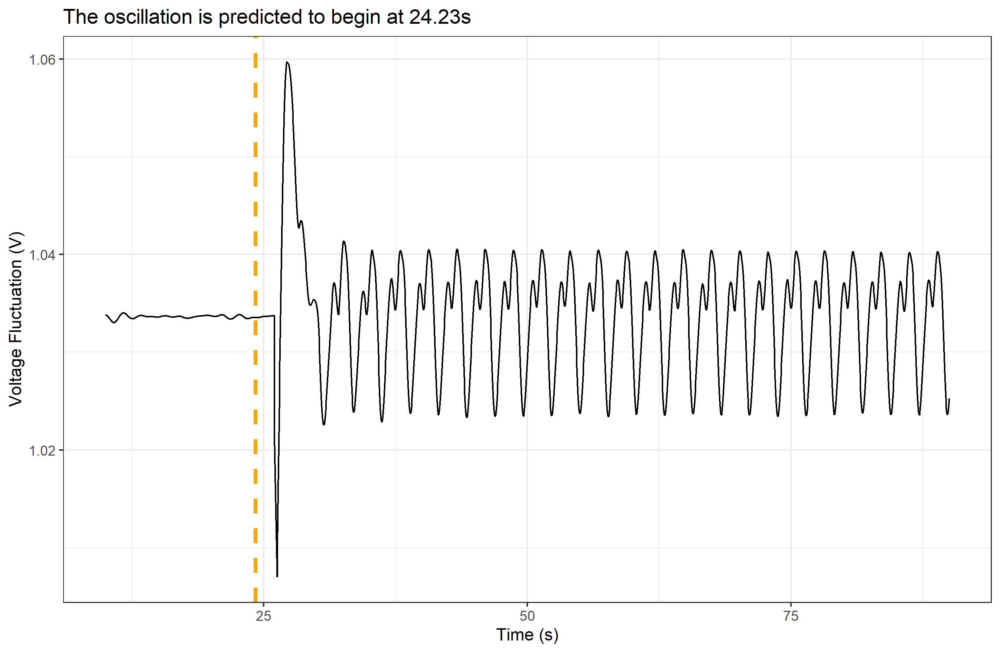
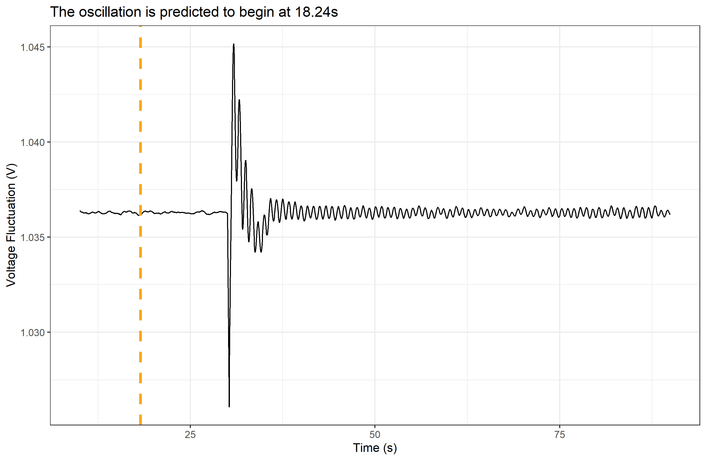

```{r setup, include=FALSE}
knitr::opts_chunk$set(echo = TRUE)

# load in various packages
if (!require(pacman)) install.packages("pacman")
p_load(tidyverse)
p_load(DT)
```

# The Reults

Without further ado:

```{r Display Results}
winners <- read_csv('CNN/Winners.csv')

winners %>% 
  datatable(options = list(
    pageLength = 13
  ))
```

Above, each case is associated with the bus that my model identified as the source of the oscillation.

# The Results?

Admittedly, my results were somewhat mixed. Some were relatively close like this:



While others were considerably further off the mark:



# Outcome

Still, I am happy with my results. If I had had more time after getting machine learning to work on my desktop, it would have been nice to take the time to better calibrate my model. Maybe vary the number of convolutional and dense layers a little. Still, I managed to produce something that I'm a little proud of.

I took in messy data in an obscure (to me) format, visually analyzed it for useful patterns, and wrote a program to attempt to replicate my observations but far faster. With some success, even!

And I'm confident that I could do it again better next time.

## Presentation

You can find the PDF of the presentation I gave for my Senior Project [here](https://github.com/Bugsydor/Energy-Senior-Project/blob/master/Presentation/Oscillation%20slides.pdf).

## More to Come (Possibly)

It would be interesting, if and when PNNL releases the contest answers, to check the accuracy, recall, and precision of the answers my model came up with.


