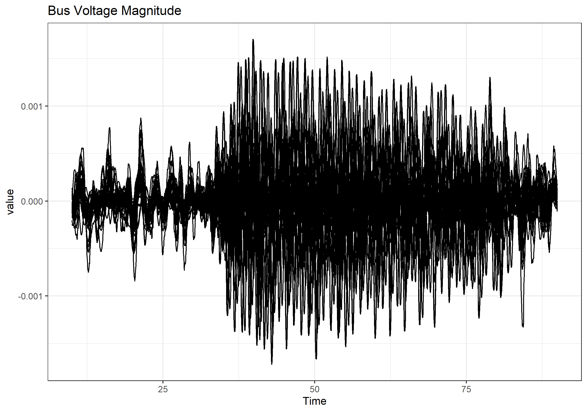

```{r setup, include=FALSE}
knitr::opts_chunk$set(echo = TRUE)

# load in various packages
if (!require(pacman)) install.packages("pacman")
p_load(tidyverse)
p_load(DT)
```

# A Change of Plans

## The Old Plan

Originally, I had planned to use spectrum analysis tools such as Fast Fourier Transforms and Waterfall charts, as well as manually windowing the data timeframes for regression analysis.

This did not work out as (admittedly nebulously) planned. While I was pleased to learn a lot about a new field for me, I would require a lot more education to utilize spectral analysis in a project like this. Also, the data proved to be more complicated than my understanding of linear regressions could compensate for.

## A New Path

Thankfully, a new idea presented itself through my studies in machine learning: 1D Convolutional Neural Networks.

### ML (Machine Learning)

First, I would like to back up a bit and build up some concepts.

Machine Learning is where you use special, trainable algorithms to make associations based on training data you give it, which associations they then apply to data from real-world situations.

Typically, this is done with some pile of mathematical tricks that would be extremely tedious to do by hand, which is why he have machines do them instead.

The most basic of these algorithms, the nearest-neighbors algorithm, classifies a data point as being the same as whatever the most similar points to it in your training data happened to be. Have all of the houses with five windows in them had a dog in your training data? This new five-windowed house will also have a dog.

### DNNs (Dense Neural Networks)

DNNs are a bit more abstract and arcane. As Randall Munroe of XKCD put it in [one of his comics](https://xkcd.com/1838/), it's basically a pile of linear algebra that you pour data into and it spits out numbers. And if the numbers don't look right, you stir the pile until things look better!

Basically, a DNN consists of several layers of 'neurons'. Each neuron in a given layer is connected, to varying degrees of strength, to each neuron in the layer above it and the layer below it, and the pattern of activated neurons in one layer influences the activation of neurons in the next. The strength of these connections is represented as an array of numbers, and these numbers are what is adjusted when one, as Randall put it, stirs the pile to make the output look right.

The first layer of a DNN 'sees' the input (such as the individual pixel brightness values in an image of a handwritten character, or one row of numeric data from a dataframe), and the pattern that evokes in the first layer cascades through any number of hidden layers until it reaches the output layer, which then spits out a result that hopefully looks more-or-less right. If it's less right, the algorithm gives it a poor score and uses that information to adjust the connections and get a better one.

### CNNs (Convolutional Neural Networks)

The major limitation of DNNs is that they have little room for nuance. They can generally only see specific patterns in an entire image or record, and have trouble recognizing similar things as being the same class.

In short, they're bad at pattern-recognition, which is what convolutional neural networks are all about.

While all neurons in a dense layer are connected to each neuron above and below them, convolutional layers' neurons are connected to each other in special ways that **preserve spatial relationships**. In other words, they can see local patterns. A series of such layers can string together patterns of patterns in a way that makes it far easier to identify, for example, pictures of street signs at odd angles.

The most famous use of CNNs, specifically 2-dimensional CNNs (2DCNNs), is image recognition. The network is fed an array of pictures, and classifies them all based on patterns it was trained to pick out in 2D space. These images, by the way, are seen as an x-coordinate, a y-coordinate, a set of brightness values, and a number of color channels equal to 1 (monochrome) or 3 (color). This is still a pile of linear algebra, in the end, but it's a more complicated and structured one.

### 1DCNNs (1-Dimensional Convolutional Neural Networks)

A 1DCNN is just like the 2D variety, but with somewhat less obvious use-cases. Rather than picking out spatial patterns in image data, where they're fed patterns of width, depth, and intensity, 1DCNNs are often fed time-series data. One or more variables with corresponding values tracked across the lock-step-march of time.

These convolutional layers pick out patterns in time, and apply labels or guess numbers based on that. And I happen to be looking for a pattern in time-series data: The start of an oscillation in the power grid.

## The New Plan

Now that I have a clear path forward, the plan is straightforward.

1. Reshape the data to fit in a 1DCNN, and split the first case data into train and test sets.

2. Create a basic 1DCNN with arbitrary hyperparameters (i.e. default-ish settings), and run the train/test data through it.

3. Use KerasTuneR to tune the hyperparameters and make a better model.

4. Use the tuned model to make predictions for when each bus started to oscillate.

5. Pick out which bus started oscillating first out of each case. That is my answer set for where each oscillation originated.

# The Relevant Data

By the way, the bus voltage angle data looked the most useful.




